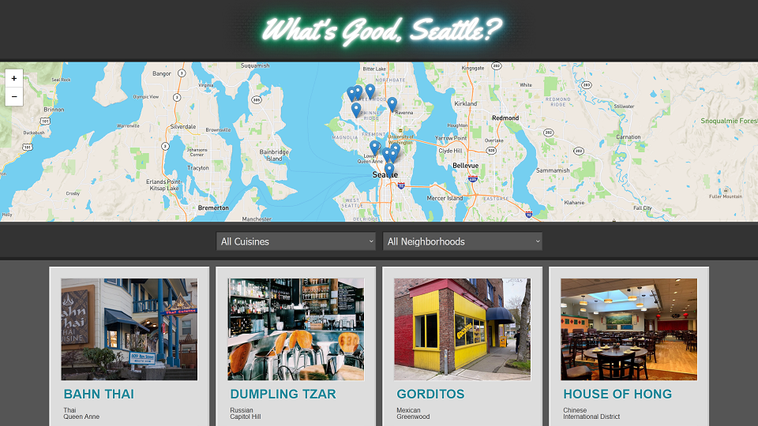

# Restaurant Reviewer

[LIVE PREVIEW](https://seanvonb.github.io/restaurant-reviewer/)

This was the final project of my Front End Web Developer Nanodegree from 2019. It was an opportunity to demonstrate using APIs and a service worker to create a stable, responsive web application with a simple database. Originally, my app used data provided by Udacity to feature locations in New York, but I've since updated the app to instead feature some Seattle favorites of mine and my friends. I also fixed the outdated implementation of Leaflet and restyled just about everything.

## Features

-   Locate restaurants on a live map
-   Filter restaurants by cuisine or neighborhood
-   Find restaurant details, like hours and address
-   Read sample reviews provided by my family and friends

## Credits

-   This project was part of my [Front End Web Developer Nanodegree](https://www.udacity.com/course/front-end-web-developer-nanodegree--nd0011).
-   [Leaflet](https://leafletjs.com/) was created by Vladimir Agafonkin and is maintained by a community of GitHub contributors.
-   Map data is provided by [OpenStreetMap](https://www.openstreetmap.org).
-   Map imagery is provided by [Mapbox](https://www.mapbox.com/).
-   All restaurant images are owned by their respective business.

## License

Copyright © 2019-2022 Sean von Bayern  
Licensed under the [MIT License](LICENSE.md)
